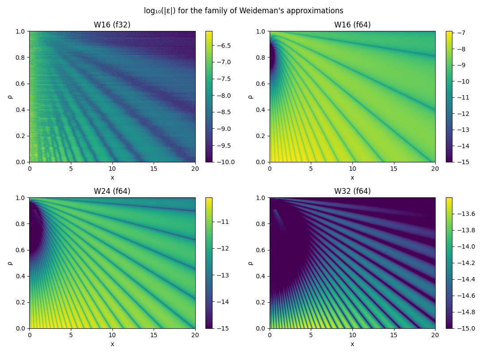
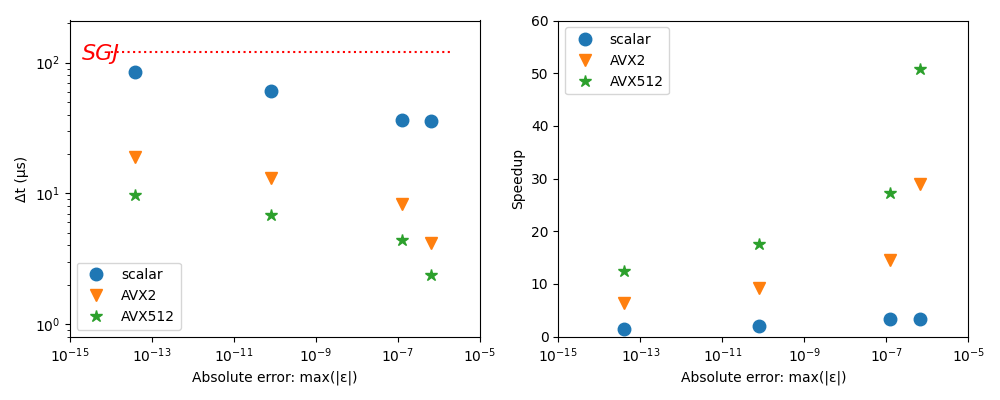

# `fast_voigt`

Efficient Voigt profile calculator in pure Rust, utilizing Weideman's approximation [^1] of the complex error function. Multiple variants for different accuracy-speed tradeoffs, with scalar, AVX2 and AVX512 implementations.

## Algorithm
The Voigt profile is given by the convolution of a Cauchy-Lorentz distribution and a Gaussian distribution [^2]. It characterizes spectral line shapes exhibiting multiple types of broadening. It cannot be evaluated in closed form, but has many approximations [^3] usually trading off accuracy for computational efficiency. The Voigt profile can be evaluated as 
$$v(x, \sigma, \gamma) = F\left(\frac{x+i\gamma}{\sqrt 2 \sigma} \right) \left( \sqrt{2\pi} \sigma\right)^{-1}$$
where F(z) is the Faddeeva function.

Weideman's approximation has several advantageous properties. It is a polynomial approximation, where one can fine tune the tradeoff between speed and accuarcy by chosing the number of terms in the expansion. It has no branches and can be evaluated with just addition, multiplication and a single division, resulting in significant speedup for SIMD implementations. In this library, three different variants are included with 16, 24 and 32-term rational expansions. For the 16 term variant, both single and double precision implementations are provided while only double precision implementations exist for W24 and W32 (no point going beyond 16 terms as floating-point arithmetic errors will dominate). The coefficients are taken from F. Schreier's Python implementation [^4]  

## Accuracy
We characterize the accuracy of the implemented algorithms by calculating 
$\varepsilon = v(x, \sigma, \gamma) - v^{*}(x, \sigma, \gamma) $ where $ v(x, \sigma, \gamma)$ is the approximated value calculated by `fast_voigt` and $v^{*}(x, \sigma, \gamma)$ is an accurate reference implementation and $v$ is normalized to have a maximum value of 1. The refence implementation in our benchmarks is the `voigt_profile` function of the xsf [^5] library,  which is in turn based on Steven G. Johnson's original implementation [^6]. The absolute accuracy is better than $10^{-6}$ for even the fastest variant, and  better than $10^{-13}$ for W32.

Absolute error for various variants, where the Voigt profile is parametrized as $v(x, \sigma=1-\rho, \gamma=\rho)$.

## Speed

The absolute evaluation speed is determined per `x` vectors of length of 2048 (AMD Ryzen 9950X). The speedup is relative to the reference implementation from the xsf library. 

### References
[^1]: Weideman, J. A. C. “Computation of the Complex Error Function.” SIAM Journal on Numerical Analysis 31, no. 5 (1994): 1497–1518. http://www.jstor.org/stable/2158232.
[^2]: https://en.wikipedia.org/wiki/Voigt_profile
[^3]: https://arxiv.org/pdf/1806.10338
[^4]: https://atmos.eoc.dlr.de/tools/lbl4IR/
[^5]: https://github.com/scipy/xsf
[^6]: http://ab-initio.mit.edu/faddeeva/